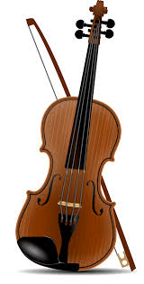

<!DOCTYPE html>
<html lang="en">
<head>
    <meta charset="UTF-8">
    <meta name="viewport" content="width=device-width, initial-scale=1.0">
    <title>Music Blog | Explore Musical Instruments</title>
    
</head>
<body>

  <header>
        <h1>Music Blog</h1>
        
Discover the beauty of musical instruments

    </header>

   <nav>
        <ul>
            <li><a href="#">Home</a></li>
            <li><a href="#blog">Blog</a></li>
            <li><a href="#contact">Contact</a></li>
        </ul>
    </nav>

   <section id="blog">
        <h2>Latest Blog Posts</h2>

   

            
            <h3>The Guitar</h3>
            <a href="posts/guitar.html">Read More</a>
        

   

            
            <h3>The Piano</h3>
            <a href="posts/piano.html">Read More</a>
        

   

            
            <h3>The Violin</h3>
            <a href="posts/violin.html">Read More</a>
        

   

            
            <h3>The Drums</h3>
            <a href="posts/drums.html">Read More</a>
        

   

            
            <h3>The Flute</h3>
            <a href="posts/flute.html">Read More</a>
        

   

            
            <h3>The Saxophone</h3>
            <a href="posts/saxophone.html">Read More</a>
        

   

            
            <h3>The Trumpet</h3>
            <a href="posts/trumpet.html">Read More</a>
        

   

            
            <h3>The Cello</h3>
            <a href="posts/cello.html">Read More</a>
        

   

            
            <h3>The Harp</h3>
            <a href="posts/harp.html">Read More</a>
        

   

            
            <h3>The Accordion</h3>
            <a href="posts/accordion.html">Read More</a>
        

    </section>

   <section id="contact">
        <h2>Contact Us</h2>
        <form id="contactForm">
            <label for="name">Name:</label>
            <input type="text" id="name" required>

   <label for="email">Email:</label>
            <input type="email" id="email" required>

   <label for="message">Message:</label>
            <textarea id="message" required></textarea>

   <button type="submit">Send</button>
        </form>
        

    </section>

   <footer>
        
&copy; 2025 Music Blog. All rights reserved.

    </footer>

   
</body>
</html>
